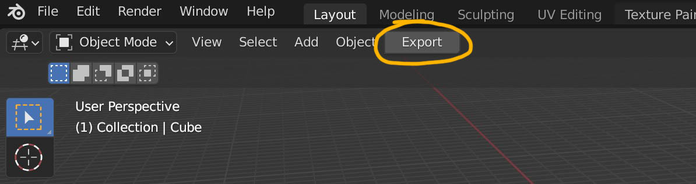
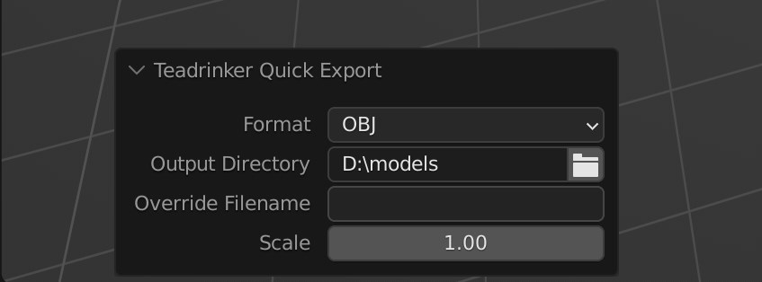

# Quick Export Blender add-on

* Export using short key CRTL-ALT-S to predefined directory
* One-click export with "Export"-button in 3D window header
* Settings and choosen directory is saved in a ***config file next to the blend file***
* Objects marked as "Disable Selection" will not be exported

## Interface

## Settings
The add-on tries to save the directory in relative form, if possible, to make it work on multiple machines.
(Full path is used, for instance, if the drive letter is different in the path of the blend file and export directory on Windows)

## Known issues
 * If the blend project is new and not yet saved, the export setting can be lost within the session
 * It will try to export each time you change any of the the parameters, as long as there is a valid export path.
 * Only supports OBJ/FBX, and only global scaling, other export parameters are hard coded (but it is quite easy to change in the script)

## Warning, not well tested!
This was hacked together pretty quickly to improve our own workflow, however I tried to follow the add-on guidelines. I will probably not submit this to the official blender repo as I am unsure if I would really have the patience to maintain it over time.
