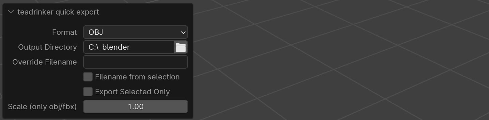

# Quick Export Blender add-on

* Export using short key CRTL-ALT-S to predefined directory
* One-click export with "Export"-button in 3D window header
* Settings and choosen directory is saved in a ***config file next to the blend file***
* Objects marked as "Disable Selection" will not be exported

## Interface

## Settings
The add-on tries to save the directory in relative form, if possible, to make it work on multiple machines.
(Full path is used, for instance, if the drive letter is different in the path of the blend file and export directory on Windows)

## Known issues
 * If blend project is not saved, the export setting can be lost within the session
 * It will try to export each time you change any of the the parameters, as long as there is a valid export path.
